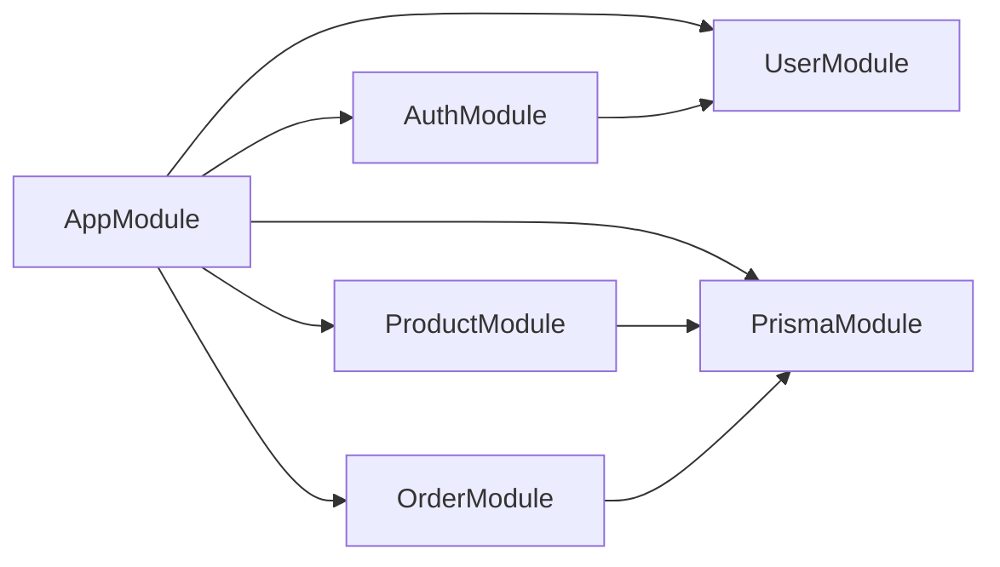

# E-commerce Order Processing System

Backend API for a product catalog, JWT authentication, and orders with line items. Built with [NestJS](https://nestjs.com/), [Prisma](https://www.prisma.io/) (SQLite via `better-sqlite3`), request validation, OpenAPI (Swagger), scheduled order status updates, and per-IP rate limiting.

## Table of contents

- [At a glance](#at-a-glance)
- [Features](#features)
- [Tech stack](#tech-stack)
- [Prerequisites](#prerequisites)
- [Quick start](#quick-start)
- [Configuration](#configuration)
- [Database](#database)
- [API and Swagger](#api-and-swagger)
- [Project structure](#project-structure)
- [Architecture](#architecture)
- [Scripts](#scripts)
- [Testing](#testing)
- [License](#license)

## At a glance

- **Runtime:** Node.js 20+ ([`package.json`](package.json) `engines`)
- **Base URL:** `http://localhost:3000` (override with `PORT` in `.env`)
- **Swagger UI:** `http://localhost:3000/api`
- **Database:** SQLite file from `DATABASE_URL` (e.g. `file:./dev.db` at the project root)

## Features

- **Authentication** — Sign-up and login with bcrypt-hashed passwords; JWT access tokens.
- **Users** — Roles `USER` (default) and `ADMIN` (seeded for local admin workflows).
- **Products** — SKU, optional description, soft-disable via `isActive`; **admin-only** create, update, delete; authenticated list (paginated) and detail.
- **Orders** — Create orders referencing **active** products by numeric `productId`; list with optional status filter and pagination; **admin-only** status updates (`PATCH /orders/:id/status`); authenticated cancel when the order is `PENDING` (`PATCH /orders/:id/cancel`).
- **Background job** — Cron promotes orders from `PENDING` to `PROCESSING` every five minutes.
- **Rate limiting** — In-memory per-IP throttling; stricter limits on auth routes; configurable via environment variables.

## Tech stack

| Layer | Technology |
|--------|------------|
| Runtime | Node.js 20+ |
| Framework | NestJS 11 |
| ORM | Prisma 7 |
| Database | SQLite (`better-sqlite3` + `@prisma/adapter-better-sqlite3`) |
| Validation | class-validator / class-transformer |
| API docs | @nestjs/swagger (UI at `/api`) |
| Auth | @nestjs/jwt, Passport JWT, bcrypt |
| Scheduling | @nestjs/schedule |
| Rate limiting | @nestjs/throttler |

## Prerequisites

- **Node.js** 20 or newer
- **npm**

## Quick start

```bash
git clone <repository-url>
cd <repo-folder>
cp .env.example .env
# Set JWT_SECRET in .env (required). Adjust DATABASE_URL if needed.
npm install
```

`npm install` runs `postinstall` → `prisma generate`.

Apply the schema to your local database:

```bash
# Production-style / CI: apply existing migrations
npx prisma migrate deploy

# Local development: create/apply migrations interactively
npm run prisma:migrate
```

Optional sample data and admin user:

```bash
npm run db:seed
```

Start the API:

```bash
npm run start:dev
```

Open [http://localhost:3000/api](http://localhost:3000/api) for Swagger.

## Configuration

Copy [`.env.example`](.env.example) to `.env` and adjust values.

The Prisma CLI reads `DATABASE_URL` from [`prisma.config.ts`](prisma.config.ts). The Nest application uses the same variable in [`src/prisma/prisma.service.ts`](src/prisma/prisma.service.ts).

### Required

| Variable | Description |
|----------|-------------|
| `DATABASE_URL` | SQLite connection string (e.g. `file:./dev.db` relative to the project root) |
| `JWT_SECRET` | Secret for signing and verifying JWTs (use a long random value in production) |

### Optional

| Variable | Default | Description |
|----------|---------|-------------|
| `PORT` | `3000` | HTTP port |
| `JWT_EXPIRES_IN` | `1d` | Access token lifetime (e.g. `12h`, `3600s`) |
| `BCRYPT_SALT_ROUNDS` | `12` | Bcrypt cost (allowed range 4–31) |
| `THROTTLE_ENABLED` | enabled | Set to `false` to disable rate limiting (e.g. e2e tests) |
| `THROTTLE_TTL_MS` | `60000` | Default rate-limit window (ms) |
| `THROTTLE_LIMIT` | `100` | Max requests per IP per window (most routes) |
| `THROTTLE_AUTH_TTL_MS` | `60000` | Window for `POST /auth/sign-up` and `POST /auth/login` |
| `THROTTLE_AUTH_LIMIT` | `10` | Max auth requests per IP per window |

## Database

| Task | Command |
|------|---------|
| Migrations (deploy) | `npx prisma migrate deploy` |
| Migrations (dev) | `npm run prisma:migrate` |
| Prisma Client | `npm run prisma:generate` (also on `npm install` via `postinstall`) |
| Seed | `npm run db:seed` |

> **Development only — seeded admin**  
> Email: `admin@example.com` — Password: `admin-secret-change-me`  
> Use **Authorize** in Swagger for admin-only product routes. Replace or remove in production.

### Data model (summary)

- **User** — Unique email, bcrypt password hash, `UserRole` (`ADMIN` | `USER`).
- **Product** — Unique `sku`, `name`, optional `description`, `isActive`.
- **Order** — `OrderStatus` (`PENDING`, `PROCESSING`, `SHIPPED`, `DELIVERED`, `CANCELLED`).
- **OrderItem** — `productId` FK to `Product`; `orderId` FK to `Order` (cascade delete on order).

**Note:** Review migration history before production deploys if you rely on preserving existing data; treat production migrations as a separate, reviewed process.

## API and Swagger

Interactive OpenAPI UI: **`/api`**

Use **Authentication** (`POST /auth/sign-up`, `POST /auth/login`) to obtain `access_token`, then **Authorize** with `Bearer <token>` for protected routes.

| Area | Auth | Summary |
|------|------|---------|
| `GET /` | Public | Health / hello (plain text); excluded from rate limiting |
| `POST /auth/sign-up`, `POST /auth/login` | Public | Register and obtain JWT; stricter rate limits |
| `/products` | JWT | List (paginated, active products) and get by id; **POST/PATCH/DELETE** require **ADMIN** |
| `/orders` | JWT | List, get, create; cancel when `PENDING`; line items use numeric **`productId`** from the products API |
| `PATCH /orders/:id/status` | JWT **+ ADMIN** | Update order status (non-admins receive 403) |

**Pagination:** List endpoints return `{ "data": [...], "meta": { "page", "limit", "total", "totalPages" } }` where applicable.

### Reviewer checklist

1. Open Swagger at `/api`.
2. Call `POST /auth/sign-up` or `POST /auth/login` and copy `access_token`.
3. Click **Authorize** and paste `Bearer <token>` (or the token alone, depending on UI).
4. `GET /products?page=1&limit=20` and note numeric `id` values.
5. `POST /orders` with body `{ "items": [ { "productId": <id>, "quantity": 1 } ] }`.
6. To try **status updates**, sign in as the seeded admin (`admin@example.com`) and call `PATCH /orders/:id/status` with a valid `OrderStatus` body; a non-admin JWT returns 403.

## Project structure

```
src/
├── app.module.ts          # Root module (schedule, throttler, feature modules)
├── app.controller.ts      # GET / health (skip throttle)
├── main.ts                # Bootstrap, Swagger, global ValidationPipe
├── auth/                  # Sign-up, login, JWT strategy, guards, roles
├── user/                  # User service and DTOs
├── product/               # Product catalog API
├── order/                 # Orders, DTOs, status scheduler (cron)
├── prisma/                # PrismaService (SQLite adapter)
├── common/                # Pagination helpers and shared DTOs
└── config/                # Throttle options for ThrottlerModule
prisma/
├── schema.prisma
├── migrations/
└── seed.ts
test/                      # Jest e2e config and specs
```

## Architecture

The app uses feature modules (`auth`, `user`, `product`, `order`) plus `prisma` and shared helpers. [`main.ts`](src/main.ts) registers a global `ValidationPipe` (whitelist, forbid unknown properties, transform). A global `ThrottlerGuard` applies default limits; [`AppController`](src/app.controller.ts) uses `@SkipThrottle()` for `GET /`. Protected routes use `JwtAuthGuard`; product mutations and `PATCH /orders/:id/status` add `AdminGuard`. `OrderStatusSchedulerService` runs on a cron schedule and moves `PENDING` orders to `PROCESSING` via `updateMany`.

Rate limiting is in-memory per process; for multiple instances behind a load balancer, consider a shared store (e.g. Redis) in production.



## Scripts

| Command | Purpose |
|---------|---------|
| `npm run start` | Start once |
| `npm run start:dev` | Start with watch |
| `npm run start:debug` | Start with debug + watch |
| `npm run build` | Compile to `dist/` |
| `npm run start:prod` | Run compiled app (`node dist/src/main.js`) |
| `npm run prisma:migrate` | Prisma migrate (development) |
| `npm run prisma:generate` | Generate Prisma Client |
| `npm run db:seed` | Run seed |
| `npm run test` | Unit tests |
| `npm run test:watch` | Unit tests in watch mode |
| `npm run test:cov` | Unit tests with coverage |
| `npm run test:e2e` | End-to-end tests |
| `npm run lint` | ESLint |
| `npm run format` | Prettier (src and test) |

## Testing

```bash
npm run test
npm run test:e2e
```

[`test/jest-e2e.setup.ts`](test/jest-e2e.setup.ts) sets defaults when unset: `JWT_SECRET`, `DATABASE_URL`, and `THROTTLE_ENABLED=false` so e2e runs stay stable.

## License

UNLICENSED — private project.
